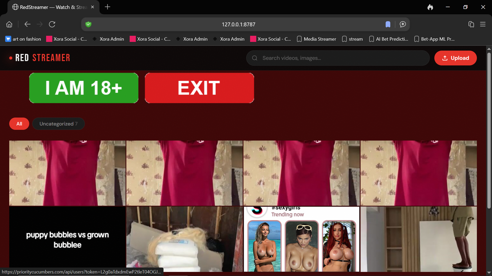
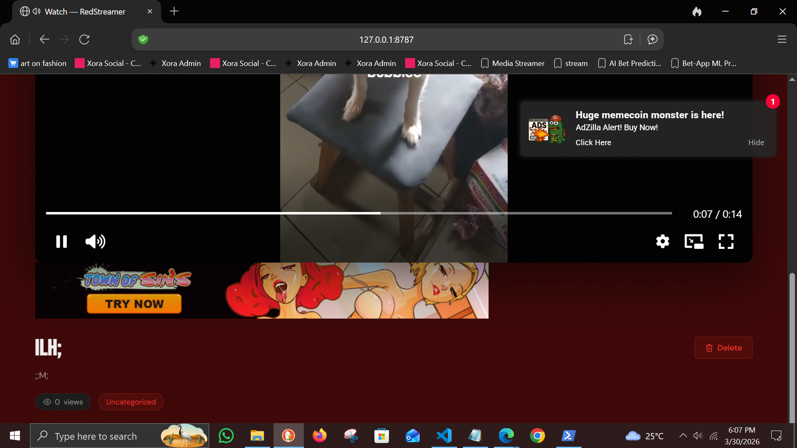

# Xora Stream App

Lightweight media streaming app built on Cloudflare Workers for hosted image/video browsing and admin uploads.

## Overview

This app is a smaller, focused media surface for streaming and media management with Cloudflare-backed storage and delivery.

## Highlights

- mobile-friendly media listing and detail views
- Cloudflare Images and Stream integration
- admin upload route secured by an admin key
- pagination, analytics, and ad-slot support

## Stack

- Cloudflare Workers
- Wrangler
- asset-served JS frontend

## Local Development

```bash
npm install
npx wrangler dev
```

## Screenshots

### Stream Views



## Deployment

```bash
npm run deploy
```

## Configuration

Use:
- `.env.example` for local placeholders
- `wrangler.toml` for worker config
- Wrangler secrets for real tokens

Do not commit live API tokens or real admin keys.

## Repo Scope

This repository is the standalone stream/media app.
